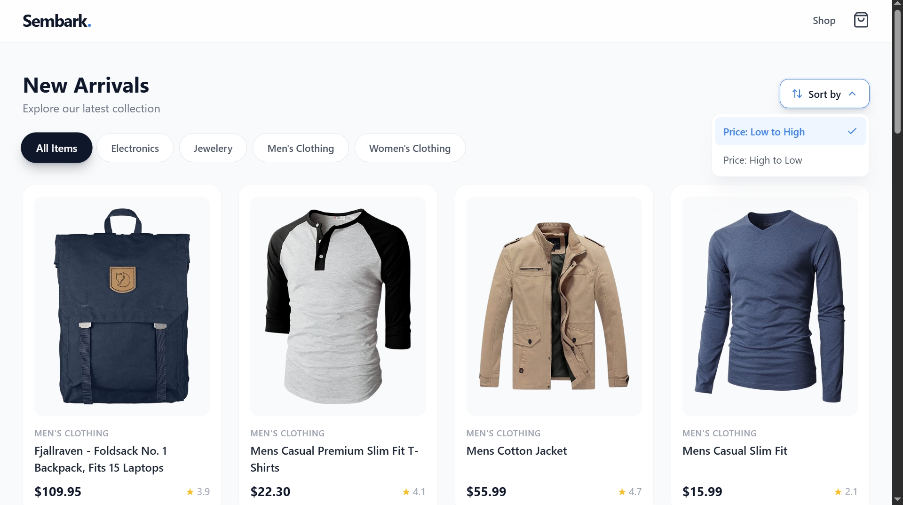

# 📦 **Sembark Ecommerce Store**

A modern and responsive **Ecommerce Web Application** built with **React + Vite**, **TailwindCSS**, and **React Router**.
This project demonstrates clean UI components, reusable architecture, and scalable project structure.

---

## 🚀 **Demo Screenshot**



---

## 📚 **Features**

* ⚡ Lightning-fast development using **Vite**
* 🎨 Styled with **TailwindCSS**
* 🔗 **React Router** for navigation
* 💡 Cleaner class management using **clsx** & **tailwind-merge**
* 🖼️ Icons from **Lucide React**
* 📁 Clean folder structure
* 📱 Fully responsive UI

---

## 🛠️ **Tech Stack**

| Technology                | Purpose                |
| ------------------------- | ---------------------- |
| **React**                 | UI library             |
| **Vite**                  | Build tool             |
| **TailwindCSS**           | Styling                |
| **React Router**          | Routing                |
| **Lucide React**          | Icons                  |
| **clsx + tailwind-merge** | Utility class handling |

---

## **Installation & Setup**

Follow these steps to run the project locally.

---

### **1. Clone the Repository**

```bash
git clone "https://github.com/MJaman786/Sembark-Ecommerce-Store.git"
```

---

### 📂 **2. Navigate into the Project Directory**

```bash
cd Sembark-Ecommerce-Store
```

---

### 📦 **3. Install Dependencies**

```bash
npm install
```

---

### ▶️ **5. Start Development Server**

```bash
npm run dev
```

---

### ▶️ **6. Build for Production**

```bash
npm run build
```

---

## 🧪 **Scripts Available**

| Command           | Description              |
| ----------------- | ------------------------ |
| `npm run dev`     | Start Vite dev server    |
| `npm run build`   | Build production assets  |
| `npm run preview` | Preview production build |
| `npm install`     | Install dependencies     |

---